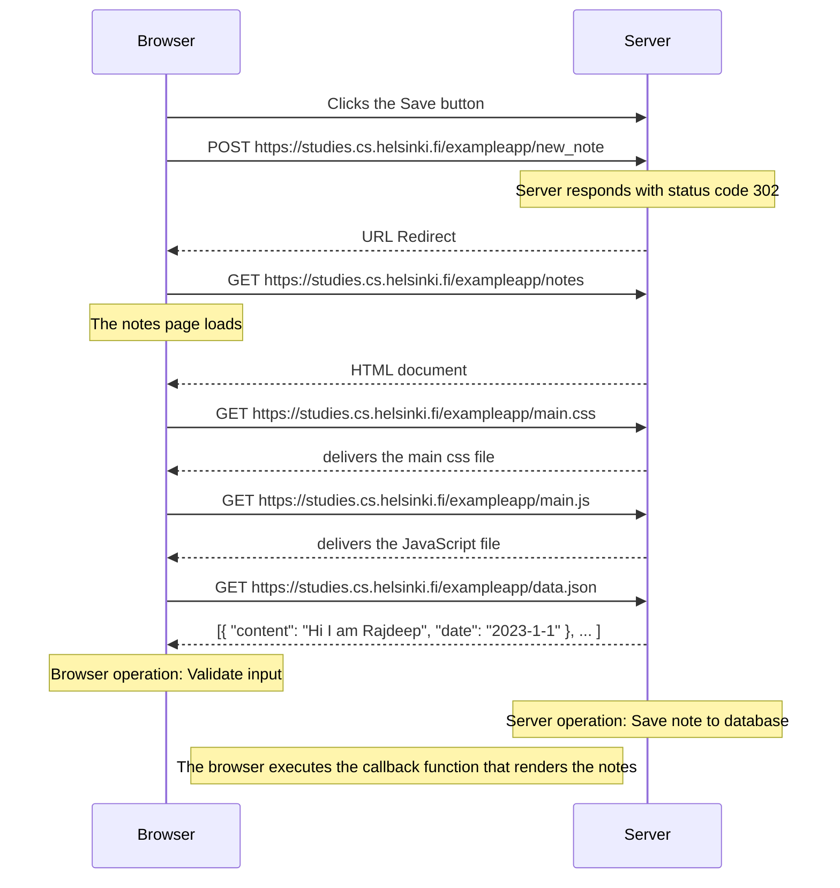

```mermaid
sequenceDiagram
    participant Browser
    participant Server
    Browser->>Server: Clicks the Save button
    Browser->>Server: POST https://studies.cs.helsinki.fi/exampleapp/new_note
    Note over Server: Server responds with status code 302
    Server-->>Browser:URL Redirect 

    Browser->>Server: GET https://studies.cs.helsinki.fi/exampleapp/notes
    Note over Browser:The notes page loads
    Server-->>Browser:HTML document

    Browser->>Server:GET https://studies.cs.helsinki.fi/exampleapp/main.css
    Server-->>Browser:delivers the main css file

    Browser->>Server:GET https://studies.cs.helsinki.fi/exampleapp/main.js
    Server-->>Browser:delivers the JavaScript file

    Browser->>Server:GET https://studies.cs.helsinki.fi/exampleapp/data.json
    Server-->>Browser: [{ "content": "Hi I am Rajdeep", "date": "2023-1-1" }, ... ]
    Note over Browser: Browser operation: Validate input
    Note over Server: Server operation: Save note to database
    Note right of Browser: The browser executes the callback function that renders the notes


```