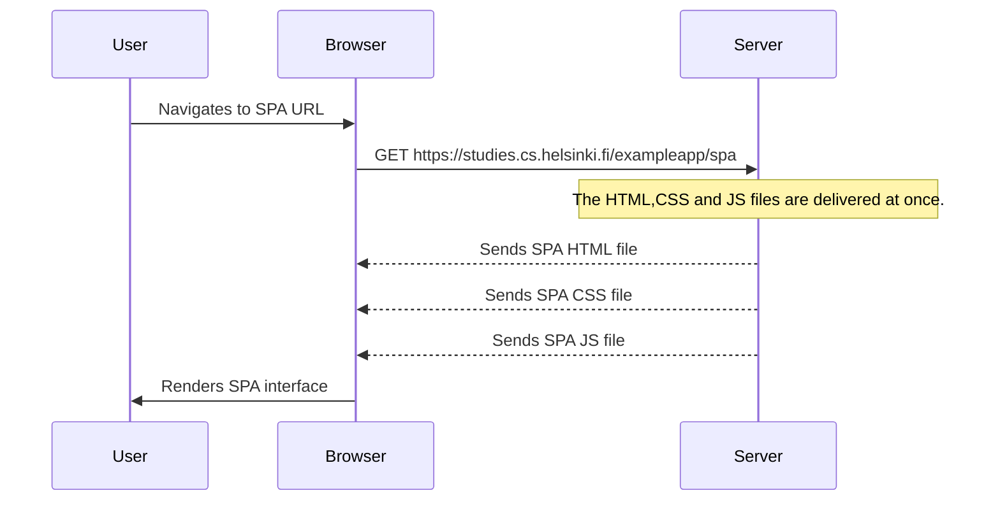

```mermaid
sequenceDiagram
    participant User
    participant Browser
    participant Server
    User->>Browser: Navigates to SPA URL
    Browser->>Server: GET https://studies.cs.helsinki.fi/exampleapp/spa
    Note over Server: The HTML,CSS and JS files are delivered at once.
    Server-->>Browser: Sends SPA HTML file
    Server-->>Browser: Sends SPA CSS file
    Server-->>Browser: Sends SPA JS file
    Browser->>User: Renders SPA interface
```