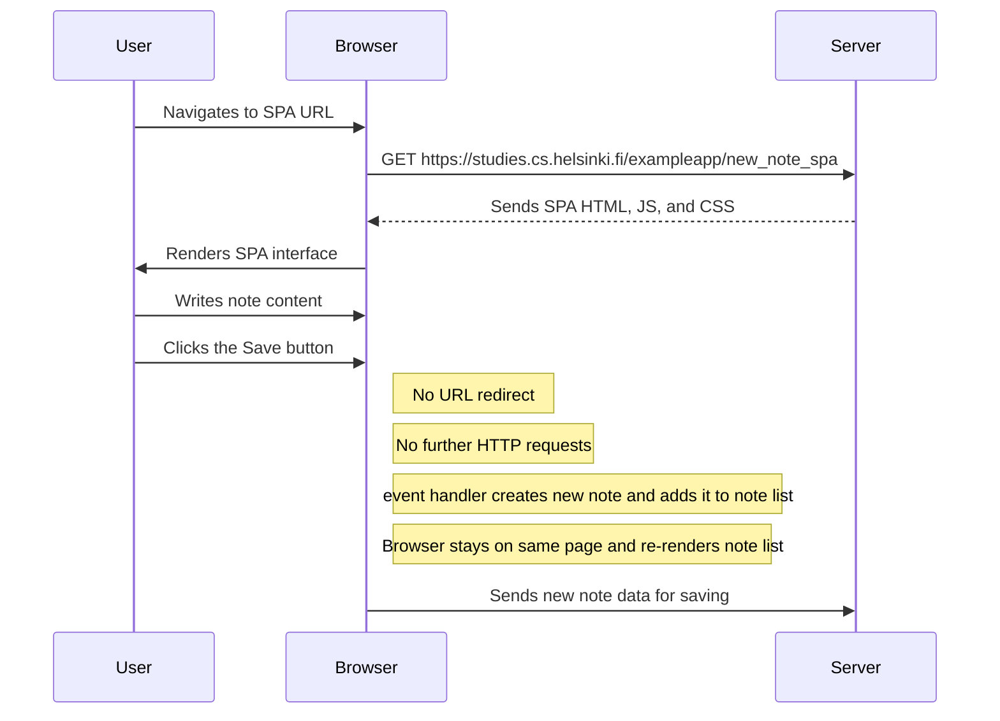

```mermaid
sequenceDiagram
    participant User
    participant Browser
    participant Server
    User->>Browser: Navigates to SPA URL
    Browser->>Server: GET https://studies.cs.helsinki.fi/exampleapp/new_note_spa
    Server-->>Browser: Sends SPA HTML, JS, and CSS
    Browser->>User: Renders SPA interface
    User->>Browser: Writes note content
    User->>Browser: Clicks the Save button
    Note right of Browser: No URL redirect
    Note right of Browser: No further HTTP requests
    Note right of Browser: event handler creates new note and adds it to note list
    Note right of Browser: Browser stays on same page and re-renders note list
    Browser->>Server: Sends new note data for saving
    
```